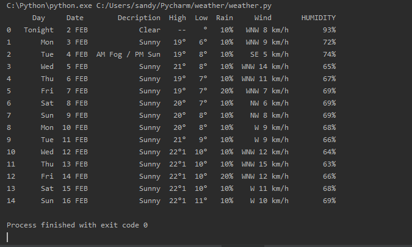

# Weather-web-scraping
<h3>Using BeautifulSoup, Requests & Pandas to scrape weather data</h3>

Easy method to do Web Scraping with help of <strong>BeautifulSoup</strong>

Here is the result ..

Thank you 💖
